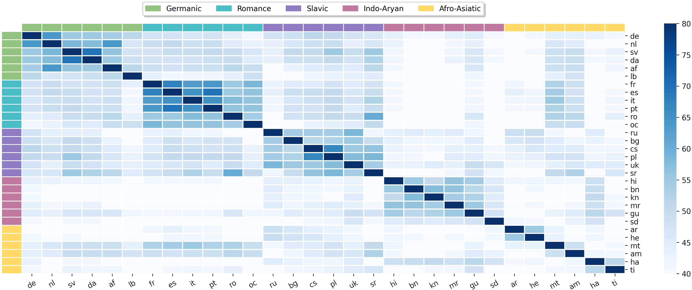

# Neuron Specialization

[](https://aclanthology.org/2024.emnlp-main.374/)
[](https://2024.emnlp.org/)

This repository contains the official implementation of our EMNLP 2024 paper:

> **Neuron Specialization: Leveraging Intrinsic Task Modularity for Multilingual Machine Translation**

## 📋 Overview

Our work investigates the trade-off between knowledge transfer and interference in multilingual translation. We discovered neurons in feed-forward layers activate in task/language-specific patterns while maintaining cross-lingual connections.

**Neuron Specialization** leverages this intrinsic modularity by identifying and updating specialized neurons through sparse networks. Our approach reduces interference while enhancing knowledge transfer, significantly improving performance for low-resource languages.



## 🔍 Contents

- [Requirements](#-requirements)
- [Dataset and Model Checkpoints](#-dataset-and-model-checkpoints)
- [Evaluation](#-direct-evaluation)
- [Training](#-training)
- [Visualization](#-visualization)
- [Citation](#-citation)

## 📦 Requirements

```
torch==1.12.0
fairseq==0.12.2
numpy==1.24.3
pandas==1.5.2
sacrebleu==2.3.1
sacremoses==0.0.53
```

## 📥 Dataset and Model Checkpoints

### EC30 Dataset
- [Download EC30 Fairseq train-val-test set data-bin](https://drive.google.com/file/d/1qHRFNU-helRLpHkr6rspqEZs0eDj-68l/view?usp=drive_link)
- After downloading, extract to: `ec30/fairseq-data-bin-sharded`

### Model Checkpoints

| Model | Description | Link |
|-------|-------------|------|
| mT-big-NS | Neuron Specialization model ("Ours" in Table 2) | [Download](https://drive.google.com/file/d/1LF8BP-5HfN9j9LfME0Jz28ULAztEUyeu/view?usp=drive_link) |
| mT-big Baseline | Baseline model ("mT-big" in Table 2) | [Download](https://drive.google.com/file/d/19pRfHSsQdhtsX_HSS-TET1U9bCsWAPI3/view?usp=sharing) |

#### Directory Structure
After downloading, extract the checkpoints to:
- NS model: `scripts/mT-big-NS/checkpoints`
- Baseline model: `scripts/mT-big-baseline/checkpoints`

## 🔄 Direct Evaluation
### Baseline Model Evaluation

1. Use the evaluation script: [scripts/mT-big-baseline/scripts/eval.sh](https://github.com/Smu-Tan/Neuron-Specialization/tree/main/scripts/mT-big-baseline/scripts/eval.sh)

2. We provide a generation template under [scripts/mT-big-baseline/results_template](https://github.com/Smu-Tan/Neuron-Specialization/tree/main/scripts/mT-big-baseline/results_template) to verify your setup.

### Neuron Specialization Model Evaluation

**Important**: Before running the evaluation, you need to:
1. Extract neurons using the validation set
2. Generate masks

Follow the steps in this script: [scripts/mT-big-NS/scripts/train.sh](https://github.com/Smu-Tan/Neuron-Specialization/blob/main/scripts/mT-big-NS/scripts/train.sh)

Then run the evaluation: [scripts/mT-big-NS/scripts/eval.sh](https://github.com/Smu-Tan/Neuron-Specialization/tree/main/scripts/mT-big-NS/scripts/eval.sh)

### Extracting Results

To extract and display results matching those in the paper (Table 11), run:

```bash
# For baseline model
python neuron_specialization/toolbox/get_result_table.py --result_dir scripts/mT-big-baseline/results_template

# For neuron specialization model
python neuron_specialization/toolbox/get_result_table.py --result_dir scripts/mT-big-NS/checkpoints
```

### Expected Results

#### Baseline Model
```
BLEU Scores:
High (5M)            Med (1M)             Low (100K)           | All (61M)
 O2M    M2O    Avg    O2M    M2O    Avg    O2M    M2O    Avg   |  O2M    M2O    Avg  
---------------------------------------------------------------------------
 28.1   31.6   29.9   29.7   31.6   30.6   18.9   26.0   22.4  |  25.6   29.7   27.6 

chrF++ Scores:
High (5M)            Med (1M)             Low (100K)           | All (61M)
 O2M    M2O    Avg    O2M    M2O    Avg    O2M    M2O    Avg   |  O2M    M2O    Avg  
---------------------------------------------------------------------------
 52.4   57.6   55.0   54.0   56.6   55.3   42.5   50.0   46.2  |  49.6   54.7   52.2 

COMET Scores:
High (5M)            Med (1M)             Low (100K)           | All (61M)
 O2M    M2O    Avg    O2M    M2O    Avg    O2M    M2O    Avg   |  O2M    M2O    Avg  
---------------------------------------------------------------------------
0.824  0.839  0.831  0.811  0.801  0.806  0.738  0.734  0.736  | 0.791  0.791  0.791
```

#### Neuron Specialization Model
```
BLEU Scores:
High (5M)            Med (1M)             Low (100K)           | All (61M)
 O2M    M2O    Avg    O2M    M2O    Avg    O2M    M2O    Avg   |  O2M    M2O    Avg  
---------------------------------------------------------------------------
 29.9   33.0   31.5   31.0   32.7   31.9   20.2   26.9   23.5  |  27.1   30.9   29.0 

chrF++ Scores:
High (5M)            Med (1M)             Low (100K)           | All (61M)
 O2M    M2O    Avg    O2M    M2O    Avg    O2M    M2O    Avg   |  O2M    M2O    Avg  
---------------------------------------------------------------------------
 53.9   58.7   56.3   55.0   57.5   56.3   43.6   50.7   47.2  |  50.8   55.6   53.2 

COMET Scores:
High (5M)            Med (1M)             Low (100K)           | All (61M)
 O2M    M2O    Avg    O2M    M2O    Avg    O2M    M2O    Avg   |  O2M    M2O    Avg  
---------------------------------------------------------------------------
0.837  0.849  0.843  0.820  0.808  0.814  0.747  0.741  0.744  | 0.801  0.799  0.800
```

## 🔬 Training

To reproduce/train a new Neuron Specialization model from scratch, use:
[scripts/mT-big-NS/scripts/train.sh](https://github.com/Smu-Tan/Neuron-Specialization/tree/main/scripts/mT-big-NS/scripts/train.sh)

## 📊 Visualization

We provide a Jupyter notebook to visualize neuron specialization patterns (corresponds to Figure 1 in the paper):
[notebook/visualize.ipynb](https://github.com/Smu-Tan/Neuron-Specialization/blob/main/notebook/visualize.ipynb)

## 📝 Citation

If you use our work in your research, please cite:

```bibtex
@inproceedings{tan-etal-2024-neuron,
    title = "Neuron Specialization: Leveraging Intrinsic Task Modularity for Multilingual Machine Translation",
    author = "Tan, Shaomu  and
      Wu, Di  and
      Monz, Christof",
    booktitle = "Proceedings of the 2024 Conference on Empirical Methods in Natural Language Processing",
    year = "2024",
    address = "Miami, Florida, USA",
    publisher = "Association for Computational Linguistics",
    url = "https://aclanthology.org/2024.emnlp-main.374/",
}
```

If you use the EC30 dataset, please also cite:

```bibtex
@inproceedings{tan2023towards,
  title={Towards a Better Understanding of Variations in Zero-Shot Neural Machine Translation Performance},
  author={Tan, Shaomu and Monz, Christof},
  booktitle={Proceedings of the 2023 Conference on Empirical Methods in Natural Language Processing},
  pages={13553--13568},
  year={2023}
}
```

## 🔗 Links

- [Paper](https://aclanthology.org/2024.emnlp-main.374/)

